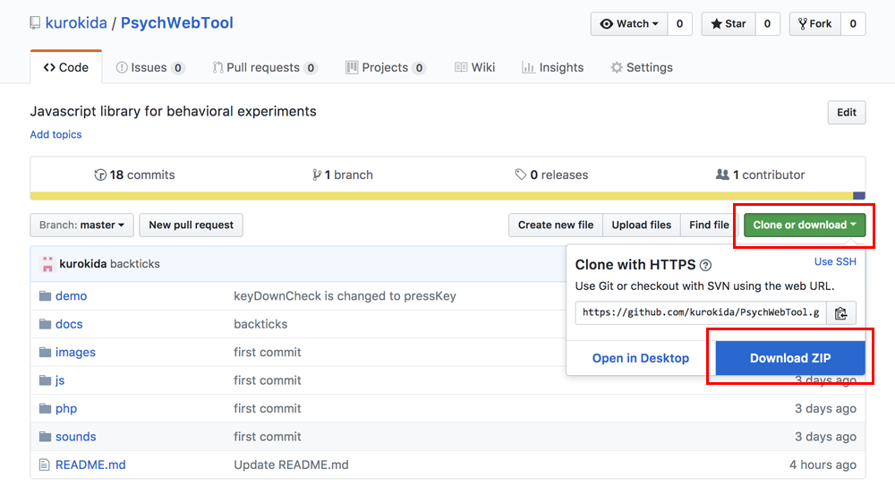

This is a tutorial to use PsychWebTool.

# Download
Please download all files from [GitHub.](https://github.com/kurokida/PsychWebTool){:target="_blank"}



# A template html file
This is a template html file for almost all PsychWebTool (PWT) programs. The template.html is located in the **demo** folder. You can get started by adding your original code to the file, and need not to know the content of the file in detail.

```
<!DOCTYPE html>
<html lang="ja">
<head>
    <meta charset="UTF-8">
    <script type="text/javascript" src="../js/jquery.min.js"></script>
    <script type="text/javascript" src="../js/jspsych.js"></script>
    <script type="text/javascript" src="../js/pwt.js"></script>
<title>Page title whatever you want</title>
<style type="text/css">
/* Please add your css here or in an external file */
body {
    margin: 0;
    padding: 0;
}
#mainCanvas {
    position:absolute;
    top: 0px;
    left: 0px;
    z-index: 1;
}
</style>

<script type="text/javascript">

onload = function() {
    document.addEventListener("keyup", keyUpFunc);
    document.addEventListener("keydown", keyDownFunc);
    document.addEventListener("mouseup", mouseUpFunc);
    document.addEventListener("mousedown", mouseDownFunc);
    document.addEventListener("mousemove", mouseMoveFunc);
    
    runExp();
}

// Please note that when you change the size of the window the program is initialized.
resizeTimer = false;
onresize = function (){
    if (resizeTimer !== false) {
        clearTimeout(resizeTimer);
    }
    resizeTimer = setTimeout(function() {
        location.reload();
    }, 200);
}

async function runExp() { // "async" is needed.
    myCanvas = document.getElementById('mainCanvas');
    if (!myCanvas || !myCanvas.getContext) {
        alert("Your web browser does not meet the requirements for this program.");
        return false;
    }

    // Canvas fits the entire window
    myCanvas.width = window.innerWidth;
    myCanvas.height = window.innerHeight;

    centerX = myCanvas.width / 2;
    centerY = myCanvas.height / 2;

    ctx = myCanvas.getContext('2d');

    bgColor = "rgb(128, 128, 128)"; // Back ground color
    stimColor = "rgb(255, 255, 255)"; // Stimulus color

    // Please write your code from here

}

</script>
</head>
<body>
    <canvas id="mainCanvas"></canvas> 
    <canvas id="circleID"></canvas> 
</body>
</html>

```
